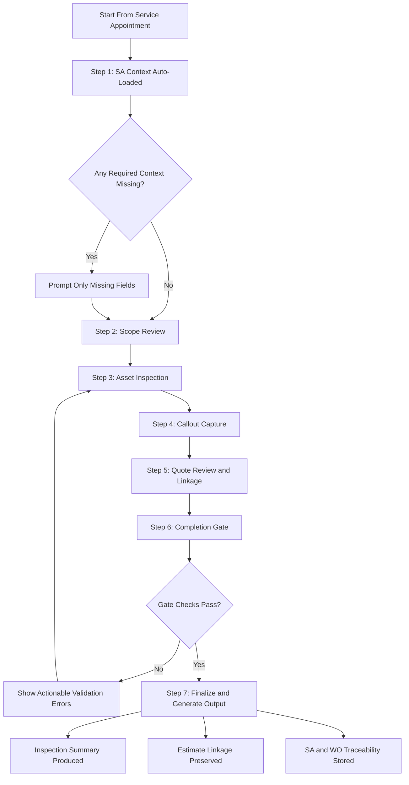

# Session Addendum Spec and Prototype Evaluation

Date: May 27, 2026
Scope: Translate integrated browser review learnings into an implementation-oriented spec and evaluate current desktop/mobile prototype coverage.

## Session Addendum - Learnings From Integrated Browser Review (May 27, 2026)

### Learning 1: SA-defined context removes redundant checkup setup
- Observation: IrrigationCheckups starts with explicit context selection (client/site/reason/report type).
- Interaction from discussion: We confirmed this is redundant for us because FSM Service Appointment already defines service type and assignment context.
- Decision impact: Start checkup directly from SA context and only prompt for missing values.

### Learning 2: Product value is execution guidance, not front-door data entry
- Observation: The flow value is in guided execution from inspection through output.
- Interaction from discussion: We aligned on prioritizing guided workflow and quality controls over additional setup fields.
- Decision impact: Invest in staged inspection UX tied to SA progression.

#### PRD Acceptance Criteria for Learning 2 (Execution Guidance)

##### A. Time-to-Complete Targets
- AC-2.1: Median time from opening an in-progress Service Appointment checkup flow to reaching "Ready to Finalize" is <= 15 minutes for a standard residential visit (1 controller, <= 12 zones).
- AC-2.2: P90 time from opening the checkup flow to "Ready to Finalize" is <= 25 minutes for the same scope.
- AC-2.3: Median time from first callout capture to linked estimate-line creation is <= 60 seconds.
- AC-2.4: Median time from "Finalize" to generated customer-facing summary artifact is <= 2 minutes.

##### B. Guided-Step Minimums
- AC-2.5: The experience must present at least 7 guided steps in sequence: SA Context, Scope Review, Asset Inspection, Callout Capture, Quote Review, Completion Gate, Finalize and Output.
- AC-2.6: Each step must display a single primary next action and step position (for example, "Step 3 of 7").
- AC-2.7: Users cannot skip directly to Finalize unless Completion Gate validations pass.
- AC-2.8: Users can navigate backward without losing entered data (autosave required at step transitions).

##### C. Service Appointment Context Rules
- AC-2.9: Client, site, service type, and assigned technician are auto-loaded from Service Appointment at flow start.
- AC-2.10: The flow must not prompt users to re-enter values already present on Service Appointment unless the value is missing or invalid.
- AC-2.11: Missing required SA context fields are surfaced as targeted prompts before inspection starts.

##### D. Completion Gate Checks (Required)
- AC-2.12: All assets in current appointment scope must be marked Checked, Deferred with reason, or Not Present with reason.
- AC-2.13: Every callout must include Issue Type and Asset/Zone association.
- AC-2.14: Any callout with severity Critical or Safety must include at least one photo.
- AC-2.15: Required system-level readings configured by Work Type (for example static pressure) must be completed before Finalize.
- AC-2.16: Null or empty display labels for scoped assets/zones are blocked at Finalize; user receives actionable validation messages.

##### E. Quote and Output Linkage
- AC-2.17: Every quotable callout can be converted to or linked with an estimate line without leaving the guided flow.
- AC-2.18: Final summary output includes inventory snapshot, callouts, and quote summary sections.
- AC-2.19: Output generation must preserve Service Appointment and Work Order references for traceability.

##### F. Quality and Reliability Metrics
- AC-2.20: >= 95% of completed checkups pass Completion Gate without reopening due to missing required fields.
- AC-2.21: <= 2% of completed checkups contain post-finalization data-quality defects related to null labels or missing required associations.
- AC-2.22: Flow autosave failure rate is < 1% of step transitions.

##### Intent Diagram (Mermaid)

### Learning 3: Structured callouts are the speed/consistency lever
- Observation: Repair entry is checklist-first with optional notes/photos.
- Interaction from discussion: We agreed structured issue capture should be primary, with free text as optional enrichment.
- Decision impact: Keep standardized issue taxonomy by asset/zone type.

#### PRD Acceptance Criteria for Learning 3 (Structured Callouts)

##### A. Coverage and Adoption Targets
- AC-3.1: >= 90% of callouts on completed checkups use a predefined issue type from the active taxonomy.
- AC-3.2: <= 10% of callouts use Other; Other requires a short explanation.

##### B. Required Structured Fields
- AC-3.3: Every callout must include Issue Type, related Asset or Zone, Severity, and Disposition before it can be saved as complete.
- AC-3.4: If Disposition is Deferred, Deferred Reason is required.
- AC-3.5: If Severity is Critical or Safety, at least one photo is required before Finalize.

##### C. Capture Speed and Usability
- AC-3.6: Median time to add a structured callout after selecting an asset or zone is <= 20 seconds.
- AC-3.7: P90 time to add a structured callout after selecting an asset or zone is <= 45 seconds.
- AC-3.8: Free-text notes are optional and cannot substitute for required structured fields.

##### D. Quote Linkage Expectations
- AC-3.9: Every quotable callout can be linked to or converted into an estimate line in <= 2 user actions after save.
- AC-3.10: Callout to estimate linkage preserves Issue Type and Asset or Zone association for traceability.

##### E. Taxonomy Governance and Analytics Integrity
- AC-3.11: Issue taxonomy is context-scoped by asset type and zone type (for example backflow, controller, zone).
- AC-3.12: Taxonomy updates are versioned and do not overwrite historical callout classifications.
- AC-3.13: Reporting can segment callouts by Issue Type, Severity, Disposition, and asset context across time.

##### F. Data Quality and Reliability Metrics
- AC-3.14: <= 2% of finalized checkups contain callouts missing required associations or structured fields.
- AC-3.15: <= 1% of callout save attempts fail due to platform or autosave error.
- AC-3.16: 100% of Critical or Safety callouts in finalized checkups meet photo requirement.

##### Implementation Notes
- Structured checklist-first capture is the default; free text is enrichment only.
- Avoid broad, unscoped picklists; present issue options filtered by context.
- Preserve an Other option with required explanation for edge cases.

### Learning 4: Quote linkage during inspection enables one-pass workflow
- Observation: Repair actions route directly to quote-related capture.
- Interaction from discussion: We aligned this prevents re-entry and supports technician throughput.
- Decision impact: Maintain direct linkage from callouts to estimate lines while in appointment.

#### PRD Acceptance Criteria for Learning 4 (In-Flow Quote Linkage)

##### A. Availability and Access
- AC-4.1: 100% of quotable callouts expose an Add to Estimate action within the same guided flow context.
- AC-4.2: Users can add one or more estimate lines from a single callout (for example labor + parts).

##### B. Speed and Throughput Targets
- AC-4.3: Median time from callout save to linked estimate-line creation is <= 60 seconds.
- AC-4.4: P90 time from callout save to linked estimate-line creation is <= 120 seconds.
- AC-4.5: Quote totals refresh immediately after line add, edit, or remove without full-page reload.

##### C. Link Integrity and Traceability
- AC-4.6: Each callout-to-estimate link stores callout ID, asset or zone ID, issue type, severity, creator, and timestamp.
- AC-4.7: Output artifacts preserve callout-to-quote mapping for audit and customer review.
- AC-4.8: Users can unlink and relink estimate lines; all link changes are audit logged.

##### D. Validation and Completion Expectations
- AC-4.9: Finalized checkups have <= 5% quotable callouts left unlinked to estimate lines, excluding Disposition values Monitor or Deferred.
- AC-4.10: If Disposition is Deferred, Deferred Reason is required and quote-link requirement is waived.
- AC-4.11: If a callout is deleted, the user must choose whether to delete linked estimate lines or preserve them with link removal.

##### E. Pricing and Suggestion Behavior
- AC-4.12: System provides default estimate suggestions by issue type and context (item, labor, quantity, price) when available.
- AC-4.13: Suggested values are editable based on role permissions.
- AC-4.14: If pricing catalog is unavailable, users can create provisional lines with pending price status.

##### F. Reporting and KPI Readiness
- AC-4.15: Reporting exposes quote linkage rate: linked quotable callouts divided by total quotable callouts.
- AC-4.16: Reporting exposes time-to-first-linked-estimate-line from first callout in the session.
- AC-4.17: Summary output includes callout quote disposition values: Quoted, Deferred, Monitor, or Not Quoted with reason.

##### Implementation Notes
- Prioritize capture-once behavior: callout details should pre-populate estimate-line context.
- Detect potential duplicate estimate suggestions and prompt Merge or Keep Both.
- Keep linkage interaction inside inspection flow to avoid cross-screen re-entry.

### Learning 5: Completion gates are essential but must be trustworthy
- Observation: Assets Checked provides a closeout control; some zone labels rendered as null in the checklist.
- Interaction from discussion: We agreed gates are useful only with strong validation and fallback display logic.
- Decision impact: Add required-field and label integrity checks before finalize.

#### PRD Acceptance Criteria for Learning 5 (Completion Gates)

##### A. Gate Coverage and Enforcement
- AC-5.1: 100% of finalized checkups must pass all hard-stop completion gate rules.
- AC-5.2: Finalize action is blocked when any hard-stop gate fails.
- AC-5.3: Save-in-progress remains available when Finalize is blocked.

##### B. Required Gate Checks
- AC-5.4: Every in-scope asset and zone is marked Checked, Deferred with reason, or Not Present with reason.
- AC-5.5: Every callout includes required structured fields: Issue Type, related Asset or Zone, Severity, and Disposition.
- AC-5.6: Critical or Safety callouts require at least one photo before Finalize.
- AC-5.7: Work Type-required system readings (for example static pressure) are completed before Finalize.
- AC-5.8: Null or empty asset or zone labels are blocked at Finalize with actionable error messages.
- AC-5.9: Quotable callouts are either linked to estimate lines or explicitly waived by disposition rule.

##### C. Error Handling and Usability
- AC-5.10: 100% of gate errors are field-specific and actionable (no generic validation-only messages).
- AC-5.11: Clicking a gate error deep-links user to the exact record or field requiring correction.
- AC-5.12: Median time to resolve gate errors and reach Ready to Finalize is <= 90 seconds.

##### D. Data Quality Outcomes
- AC-5.13: <= 3% of finalized checkups require reopening due to missing mandatory completion data.
- AC-5.14: <= 1% of finalized outputs contain null or empty display labels in customer-facing sections.
- AC-5.15: 100% of finalized Critical or Safety callouts satisfy required evidence rules.

##### E. Auditability and Policy Controls
- AC-5.16: Any waived gate condition is stored with waiver reason, user, timestamp, and policy reference.
- AC-5.17: Completion gate results are retained in audit history for each finalized checkup.

##### Implementation Notes
- Use hard-stop checks only for safety, compliance, and data integrity requirements.
- Keep informational and cosmetic checks as warnings, not blockers.
- Surface a single Ready to Finalize panel that summarizes pass and fail status.

### Learning 6: Mapping is high-value context but needs durable implementation choices
- Observation: In-checkup map supports field context; runtime warnings indicated maintainability concerns.
- Interaction from discussion: We aligned mapping should be treated as a core product surface, not an add-on.
- Decision impact: Use current map APIs and performance-safe loading patterns from launch.

#### PRD Acceptance Criteria for Learning 6 (Operational Mapping)

##### A. Core Availability and Rendering
- AC-6.1: 100% of in-scope assets with valid coordinates render on the map with correct type icon and label.
- AC-6.2: Map and asset list remain synchronized; selecting in one highlights and focuses the other.
- AC-6.3: Users can open mapped asset detail and start callout capture in <= 2 actions.

##### B. Geospatial Capture and Editing
- AC-6.4: Users can capture or update asset GPS coordinates in-flow during inspection.
- AC-6.5: Median time from initiating GPS capture to successful save is <= 30 seconds.
- AC-6.6: Where configured, zone geometry supports point, line, or polygon capture with geometry validation.
- AC-6.7: Coordinate state is visible to users (captured now, existing, or inferred).

##### C. Performance and Reliability
- AC-6.8: Median time to first interactive map state is <= 3 seconds on target mobile network profile.
- AC-6.9: Geodata save failure rate is <= 1% across map-edit operations.
- AC-6.10: Map availability issues do not block finalize unless Work Type enforces required geodata presence.

##### D. Offline and Sync Behavior
- AC-6.11: Map edits made offline or with intermittent connectivity are queued locally and synced without data loss.
- AC-6.12: Sync conflict events are surfaced with clear user resolution options and audit trail.

##### E. Data Quality and Governance
- AC-6.13: Geodata updates retain asset ID linkage and timestamped edit history.
- AC-6.14: Required geodata checks (when enabled by Work Type) are enforced at completion gate.
- AC-6.15: Final outputs can reference mapped asset locations where available without rendering null labels.

##### F. Platform and Maintainability Controls
- AC-6.16: Mapping implementation uses current supported API patterns (no deprecated marker approach in new builds).
- AC-6.17: API loading follows performance-safe patterns suitable for mobile execution.
- AC-6.18: Map failures produce actionable diagnostics distinct from validation errors.

##### Implementation Notes
- Treat map as an operational workflow surface, not a display-only visualization.
- Preserve list-first path for technicians who do not need map interaction for a given step.
- Keep map interactions in the inspection flow to minimize context switching.

### Learning 7: Report output is part of completion, not post-process
- Observation: Create PDF is a primary action in checkup detail.
- Interaction from discussion: We aligned customer-facing output should remain first-class in the flow.
- Decision impact: Keep Salesforce-owned inspection summary generation in the core closeout path.

#### PRD Acceptance Criteria for Learning 7 (Customer-Facing Output)

##### A. Generation and Availability
- AC-7.1: 100% of finalized checkups generate a customer-facing summary artifact without manual re-entry.
- AC-7.2: Median time from Finalize to report availability is <= 2 minutes.
- AC-7.3: P90 time from Finalize to report availability is <= 5 minutes.

##### B. Required Output Content
- AC-7.4: Report includes Service Appointment context, site summary, inspected assets and zones, and callout details.
- AC-7.5: Report includes quote summary and disposition when estimate lines exist.
- AC-7.6: Each callout shown in output preserves traceability fields: callout ID, asset or zone association, severity, and disposition.

##### C. Versioning and Auditability
- AC-7.7: Issued report versions are immutable; regeneration creates a new version with timestamp and actor.
- AC-7.8: Report lifecycle states are tracked: Generated, Sent, Viewed, Failed.
- AC-7.9: Delivery and generation events are stored with timestamp and source (user or system).

##### D. Reliability and Error Handling
- AC-7.10: Report generation failure rate is <= 1% across finalized checkups.
- AC-7.11: Failed generation attempts retry automatically and surface actionable diagnostics.
- AC-7.12: Report generation errors are distinct from completion-gate validation errors.

##### E. Data Quality Outcomes
- AC-7.13: <= 2% of issued reports require correction due to missing mandatory structured fields.
- AC-7.14: Output generation blocks null or empty labels for required customer-facing sections.

##### F. Ownership and Integration Boundaries
- AC-7.15: Salesforce remains the source of truth and system of record for inspection summary output.
- AC-7.16: External estimate workflows may link to the report but cannot overwrite issued inspection summary content.
- AC-7.17: Signature requirements are configurable by artifact type (inspection summary vs quote approval).

##### Implementation Notes
- Trigger report generation as a first-class completion step in finalize flow.
- Keep output schema aligned to structured callout and quote linkage models.
- Expose report version history and delivery status in appointment context.

### Learning 8: Reduce front-door prompts to improve field speed
- Observation: Asking for known context increases cognitive and time overhead.
- Interaction from discussion: You confirmed service type is already defined by SA, so setup should not repeat it.
- Decision impact: Prefill from SA and move users directly into inspection work.

#### PRD Acceptance Criteria for Learning 8 (Context Prefill and Prompt Minimization)

##### A. Context Hydration and Prefill
- AC-8.1: 100% of checkup starts auto-load client, site, service type, and assigned technician from Service Appointment when available.
- AC-8.2: Session start does not request re-entry of already-populated Service Appointment context fields.
- AC-8.3: Context hydration failure rate is <= 1% of session starts.

##### B. Prompt Rules and Exceptions
- AC-8.4: Users are prompted only for missing or invalid required context fields before inspection begins.
- AC-8.5: Non-critical optional context fields never block entry into inspection workflow.
- AC-8.6: Context overrides are role-based and require reason capture.

##### C. Start-Flow Speed Targets
- AC-8.7: Median time from opening checkup flow to first actionable inspection screen is <= 15 seconds.
- AC-8.8: P90 time from opening checkup flow to first actionable inspection screen is <= 30 seconds.
- AC-8.9: Users can continue immediately after completing missing required prompts without re-running setup steps.

##### D. Data Integrity and Auditability
- AC-8.10: 100% of context overrides are audit logged with prior value, new value, user, timestamp, and reason.
- AC-8.11: Duplicate context correction rate after checkup start is <= 5% of sessions.
- AC-8.12: Context summary is always visible at start for quick technician verification.

##### E. Reliability and Recovery
- AC-8.13: Context prefill failures surface actionable recovery guidance with fallback path in <= 1 user action.
- AC-8.14: Start-flow abandonment due to context issues is <= 2% of sessions.
- AC-8.15: Error messaging clearly distinguishes data-missing conditions from system-load failures.

##### Implementation Notes
- Treat Service Appointment as the authoritative source of start context.
- Minimize front-door prompts by enforcing prompt-only-for-exception behavior.
- Keep context visible but editable only by permitted roles.

## Evaluation of Current Prototypes (Desktop and Mobile)

### Evaluation Method
- Compared active desktop and mobile prototype capabilities against Learnings 1-8 and AC clusters.
- Focused on implemented behavior in primary surfaces, not archived variants.

### Current Prototype Surfaces Evaluated
- Desktop: desktop_v3.1.html + property_record.js
- Mobile: mobile_v3.1.html

### Coverage Snapshot

| Learning | Mobile Prototype | Desktop Prototype | Net Assessment |
|---|---|---|---|
| L1 SA context prefill | Partial | Partial | Both have context models but not SA-first hydration/prompt-only exceptions flow. |
| L2 guided execution flow | Partial | Low | Mobile has guided sections and submit flow; neither has explicit 7-step wizard with step index and guarded back/forward states. |
| L3 structured callouts | Partial-Strong | Medium | Mobile checklist-first capture is strong for speed; required fields (severity/disposition/photo) and taxonomy governance are incomplete. |
| L4 in-flow quote linkage | Low | Low-Medium | Desktop shows proposals table; mobile has no in-flow estimate creation/linking from callouts. |
| L5 completion gates | Partial | Low | Mobile has hard/soft submit gates; required gate matrix and deep-link field-level error model not fully implemented. |
| L6 operational mapping | Partial-Strong | Medium-Strong | Both support map/list context and asset interactions; offline queueing/conflict resolution and finalize-linked geodata requirements are not fully present. |
| L7 customer-facing output | Low | Low | Neither prototype currently demonstrates true summary artifact generation/versioning/delivery lifecycle. |
| L8 prompt minimization | Partial | Partial | Both avoid heavy front-door setup in places, but no formal SA-context hydration + role-based override audit controls. |

### Mobile Prototype Evaluation

#### What is Working Well
- Work Order to WOLI transition and per-WOLI state isolation are implemented.
- Checklist-first callout capture flow is implemented and favors structured capture speed.
- Submit gating exists with hard blockers (callout policy and AM assignment) plus soft-gated required-question advisory.
- Map/list hybrid interaction supports asset edit/create/remove and inline checklist interaction.

#### Gaps Against Learnings and ACs
- No explicit 7-step guided sequence with visible position indicator (for example Step 3 of 7).
- Submit is not equivalent to finalized completion gate matrix (missing full hard-stop checks for severity/photo/system readings/null labels/quote waiver logic).
- Structured callout requirements are incomplete versus target fields (Issue Type + Asset/Zone + Severity + Disposition + deferred reason + critical-photo requirement).
- No in-flow estimate linkage model from callout to line item with preserved traceability fields.
- No customer-facing inspection summary artifact generation/versioning/status lifecycle.
- SA-context hydration and prompt-only exceptions model is not explicit at session start.

### Desktop Prototype Evaluation

#### What is Working Well
- Rich record-page workspace exists with details, hierarchy, map, program, and related data tabs.
- Related inspection/callout/proposal views create useful desktop context for planning and audit review.
- Embedded map integration and map feature state provide useful operational mapping baseline.
- Local storage state and migration logic support repeatable demo and data-shape iteration.

#### Gaps Against Learnings and ACs
- Desktop is a record management surface, not an end-to-end guided checkup execution flow.
- No explicit completion gate workflow before finalize.
- Callouts and proposals are displayed, but direct callout-to-estimate in-flow creation/linking is not implemented.
- No finalized output generation step with immutable versioning and delivery state tracking.
- SA-first context hydration/prompt minimization and override auditing are not implemented as a formal start flow.

### Key Risks if Current Prototypes Are Used as Direct Build Baseline
- Risk 1: Team may over-index on tabbed record UI and under-deliver the required guided execution sequence.
- Risk 2: Submit behavior may ship with partial gate logic, causing post-finalization data quality defects.
- Risk 3: Quote linkage may remain a separate workflow, increasing re-entry and lowering technician throughput.
- Risk 4: Output generation may be treated as post-process instead of core completion behavior.

### Recommended Next Iteration Priorities

#### Priority 1: Introduce explicit 7-step guided shell
- Add deterministic step container with step position and one primary action per step.
- Persist step-level autosave and guarded transitions.

#### Priority 2: Implement full completion gate engine
- Add hard-stop validation matrix aligned to AC-2.12 through AC-2.16 and AC-5.4 through AC-5.9.
- Add field-specific error deep links and actionable messages.

#### Priority 3: Add callout-to-estimate linkage in-flow
- Introduce Add to Estimate action from each quotable callout.
- Persist link metadata (callout ID, asset/zone, issue type, severity, actor, timestamp).

#### Priority 4: Add finalize output artifact lifecycle
- Implement artifact generation on finalize with status model (Generated/Sent/Viewed/Failed).
- Persist immutable version history and traceability to SA/WO.

#### Priority 5: SA-context hydration and prompt minimization
- Load SA context at start, prompt only missing required values, and audit overrides.

### Confidence and Evidence
- Confidence: High for current-state prototype behavior described above.
- Evidence reviewed:
  - prototype/mobile/README.md
  - prototype/mobile/notes.md
  - prototype/mobile/mobile_v3.1.html
  - prototype/desktop/README.md
  - prototype/desktop/desktop_v3.1.html
  - prototype/desktop/property_record.js
