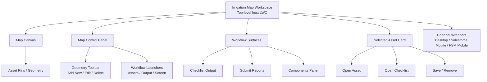

# Map LWC Responsive V1 First Pass

## Document Purpose

Track confirmed requirements and interaction decisions for a responsive Map LWC used in Salesforce Desktop, Salesforce Mobile App, and Salesforce FSM Mobile App.

## Status

- Version: First Pass, prototype-aligned update
- Date: 2026-06-01
- Source: Stakeholder Q&A decisions plus verification against `prototype/v4/mobileV4.html` and `prototype/spatial_portable/app.js`
- Scope: Current mobileV4-aligned behavior baseline with deferred items called out explicitly

## Current Prototype Verification

The items below reflect what is currently implemented in the latest mobile V4 prototype, with earlier first-pass assumptions corrected where the build has drifted.

### 1) Platform and Scope

- Component must be responsive for desktop and mobile.
- V1 target is 100% desktop feature parity.
- Runtime context is Salesforce Mobile App and Salesforce FSM Mobile App.
- Map entry is always in asset context; no out-of-context map entry point.
- Current map scope is asset context only.
- Map surface is currently delivered as an embedded spatial runtime hosted inside the mobile workspace.

### 2) Mobile Interaction Model

- Mobile interaction is map-first.
- IRRIGATION tab opens a map-first workspace with the map shown before workflow sections.
- A dedicated visible `Map Control` panel is present below the map and is auto-scrolled into view on map tab entry.
- Map Control actions are currently `Add New`, `Edit`, `Delete`, `Assets`, `Output`, and `Screen`.
- Geometry edit starts via explicit `Edit` control.
- `Assets` and `Output` actions launch dedicated workflow/dialog surfaces rather than living only inside a collapsed bottom sheet.
- Single tap on a mapped asset opens a floating selected-asset card.
- Selected-asset card actions are currently `Open Asset`, `Save`, `Open Checklist`, and `Remove`.
- Full-screen map mode is supported on mobile.
- Support for portrait and landscape remains part of the intended responsive target, but rotation-state preservation is not explicitly verified in the current prototype.
- Common mobile edit flow should target max 3 taps.

### 3) Data Loading and Performance

- Current prototype pushes the full in-scope asset payload into the embedded map runtime.
- Marker clustering with tap-to-expand is not implemented in the current prototype build.
- Under heavy density, prioritize data completeness.
- Mobile time-to-interactive target: under 2 seconds.
- Performance SLA is best-effort with no fixed FPS target.

### 4) Location and Initialization Rules

- Current prototype does not implement live device GPS with always-follow behavior.
- Status text currently falls back to `GPS unavailable` when there is no active selected asset context.
- Map runtime is launched in asset/property context.
- Embedded map initializes from selected asset context when available and otherwise falls back to configured or default map center.
- User-location fallback, always-follow, and last-known-extent behavior are not yet implemented in the current prototype.

### 5) Child Asset Auto-Selection

- Current prototype does not auto-select nearest child asset based on user location.
- If no asset is selected when the map opens, the runtime can remain in a neutral `No component selected` state.
- Nearest-child tie handling is not implemented in the current prototype.

### 6) Editing, Save, and Undo

- Full geometry editing is required on desktop and mobile.
- Current prototype still uses explicit save actions for selected-asset edits and checklist/detail flows.
- Save-state language such as `Saving`, `Saved`, and `Failed` is surfaced as workflow guidance text and runtime status messaging, not yet as a persistent inline header chip.
- Single-step undo is not implemented in the current prototype.
- Destructive actions are guarded, but the exact interaction pattern differs from the original first-pass assumption and should be treated as prototype-specific until finalized.

### 7) Offline, Sync, and Conflict Handling

- Current prototype uses local simulated persistence for runtime and map state.
- Full offline edit and sync is not implemented in the current prototype build.
- Reconnect auto-sync and conflict resolution prompts are not implemented in the current prototype build.
- Pending unsynced banner behavior is not implemented in the current prototype build.
- Shift-boundary retention behavior is not implemented in the current prototype build.

### 8) Geometry Quality and Asset Placement

- Invalid geometry auto-repair is not verified in the current prototype build.
- Adding an asset to map must be manual only; no automatic placement.
- Manual Add Asset flow starts with map placement tap, then details.
- Snapping is off by default.

### 9) Access and Audit

- Geometry edits are intended for mobile users with map access.
- Production audit requirement remains timestamp and user only.
- The current prototype is not a reliable source for final production audit implementation details.

### 10) Accessibility

- Tap-target sizing follows Salesforce mobile defaults.

## Naming Scheme Diagram

## Open Items for Follow-Up (Non-Blocking for First Pass)

- Live GPS always-follow behavior and fallback-to-last-known logic are not yet represented in the current prototype.
- Marker clustering behavior is not yet represented in the current prototype.
- Auto-save with a persistent inline save-state chip remains a target and is not yet implemented as described.
- Undo behavior remains a target and is not yet implemented.
- Full offline sync and conflict handling remain target-state behavior and are not yet implemented in the current prototype.
- Child auto-selection and nearest-child logic are not yet implemented.
- Point-placement precision assist default still needs final confirmation:
  - Crosshair plus Place Here
  - Long-press placement
  - Place then fine-adjust nudges
  - Raw tap only
- Final confirmation text pattern for destructive dialogs still needs final confirmation.
- Whether map-control iconography must exactly mirror Salesforce shell icons or can be custom within SLDS constraints still needs final confirmation.

## First Pass Acceptance Criteria Draft

- Map opens in asset context and loads the embedded spatial runtime for the active property or work-order context.
- Mobile layout is map-first with map canvas first, visible Map Control actions, and downstream workflow surfaces.
- Editing parity exists on desktop and mobile with explicit edit entry.
- User can select an asset from map context and launch asset detail or checklist actions from the selected-asset surface.
- Assets and Output controls route to the corresponding workflow surfaces or dialogs.
- Checklist photo attach and remove behavior is available in the asset detail and checklist flow.
- Full-screen map mode is available on mobile.
- Auto-save, GPS always-follow, clustering, undo, and offline conflict handling remain deferred relative to the original first-pass target.
- Initial mobile interaction is available under 2 seconds in expected V1 environments.

## Notes

This document is intended as a living decision baseline. Update it whenever the prototype meaningfully changes interaction model, save behavior, GPS behavior, or workflow surfacing so it does not drift from the latest build.
