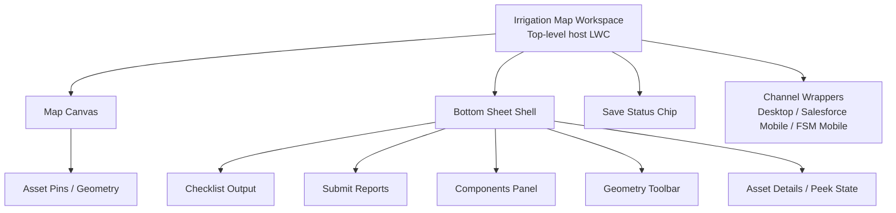

# Map LWC Responsive V1 First Pass

## Document Purpose

Track confirmed requirements and interaction decisions for a responsive Map LWC used in Salesforce Desktop, Salesforce Mobile App, and Salesforce FSM Mobile App.

## Status

- Version: First Pass
- Date: 2026-05-20
- Source: Stakeholder Q&A decisions captured in-session
- Scope: V1 behavior and acceptance baseline

## Confirmed Decisions

### 1) Platform and Scope

- Component must be responsive for desktop and mobile.
- V1 target is 100% desktop feature parity.
- Runtime context is Salesforce Mobile App and Salesforce FSM Mobile App.
- Map entry is always in asset context; no out-of-context map entry point.
- Current map scope is asset context only.

### 2) Mobile Interaction Model

- Mobile interaction is map-first.
- Use bottom sheet as primary control surface.
- Default selected-asset sheet state is peek with top actions visible.
- Pinned peek actions: Edit Details, Photo, Notes.
- Geometry edit tools live in expanded bottom sheet only.
- Single tap on asset opens details in peek sheet.
- Geometry edit starts via explicit Edit Geometry button.
- On rotation, preserve exact open panel and edit state and reflow layout.
- Support both portrait and landscape in V1.
- Common mobile edit flow should target max 3 taps.

### 3) Data Loading and Performance

- Preload entire service area (no viewport-progressive loading for V1).
- On mobile, default marker behavior is clustering with tap-to-expand.
- Under heavy density, prioritize data completeness.
- Mobile time-to-interactive target: under 2 seconds.
- Performance SLA is best-effort (no fixed FPS target).

### 4) Location and Initialization Rules

- Use live device GPS with always-follow behavior.
- Pause GPS auto-follow during active geometry editing.
- If GPS unavailable, continue with last known location and manual pan.
- Initial center rule:
  - Center on asset/parent asset context.
  - If parent asset has no location, center on user location.
  - If centering on user fallback, use neighborhood-level medium zoom.
  - If both asset location and user GPS are unavailable, open last known map extent.

### 5) Child Asset Auto-Selection

- If multiple child assets exist, auto-select nearest child to user location.
- If nearest assets tie, center between tied assets.
- After tie-center, keep neutral map view with no auto-highlight selection.

### 6) Editing, Save, and Undo

- Full geometry editing is required on desktop and mobile.
- Auto-save every change (no explicit save button flow).
- Show inline save-state chip in sheet header: Saving / Saved / Failed.
- If auto-save fails, keep editing enabled, mark pending, retry in background.
- Single-step undo is required.
- Destructive actions use a single confirmation dialog.

### 7) Offline, Sync, and Conflict Handling

- Full offline edit and sync is required.
- On reconnect, auto-sync immediately in background.
- If conflicts occur, prompt user to resolve.
- Pending unsynced state is indicated by global banner only.
- If user edits an asset with pending unsynced changes, append to same pending change set.
- Offline cache retention: current shift/day only.
- Shift boundary behavior: carry pending unsynced edits into next shift until synced.

### 8) Geometry Quality and Asset Placement

- Invalid geometry handling: auto-repair in background.
- If auto-repair fails, allow manual geometry edit to resolve.
- Adding an asset to map must be manual only (no automatic placement).
- Manual Add Asset flow starts with map placement tap, then details.
- Snapping is off by default.

### 9) Access and Audit

- Geometry edits allowed for any mobile user with map access.
- Audit requirement for geometry changes: timestamp and user only.

### 10) Accessibility

- Tap-target sizing follows Salesforce mobile defaults.

## Naming Scheme Diagram

## Open Items for Follow-Up (Non-Blocking for First Pass)

- Point-placement precision assist default:
  - Crosshair + Place Here
  - Long-press placement
  - Place then fine-adjust nudges
  - Raw tap only
- Final confirmation text pattern for destructive dialogs.
- Whether map-control iconography must exactly mirror Salesforce shell icons or can be custom within SLDS constraints.

## First Pass Acceptance Criteria Draft

- Map opens in asset context and follows initialization fallback rules.
- Mobile layout is map-first with bottom sheet behavior as specified.
- Editing parity exists on desktop and mobile with explicit edit entry.
- Auto-save, pending-state, and retry logic function with inline status.
- Offline edits persist, auto-sync on reconnect, and conflict prompts appear when needed.
- Rotation preserves UI/edit state in both portrait and landscape.
- Initial mobile interaction is available under 2 seconds in expected V1 environments.

## Notes

This document is intended as a living decision baseline. Update this file as additional UX/engineering constraints are finalized.
