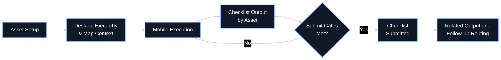

# Project Details

| Project Name | FSM Irrigation Feature (V4.1 Baseline) |
| --- | --- |
| Desired Delivery Date | Target pilot readiness: Q3 2026 (final date TBD) |
| Application(s) | Salesforce Field Service Desktop Record Workspace, Salesforce Field Service Mobile WOLI Workspace |
| Business Sponsor | James Carr |
| Business Unit | Operations - Irrigation |
| Project Lead | FSM Product and Architecture |

# Version History

| Version # | Date | Author | Reason |
| --- | --- | --- | --- |
| 1.0 | 2026-06-05 | GitHub Copilot (draft from repo requirements) | Initial populated version based on irrigation requirement corpus |

# Project Description

This feature establishes a unified irrigation operating model across desktop and mobile execution. Desktop users manage property-level irrigation assets, hierarchy, map context, controller programs, and related records. Mobile users execute irrigation Work Order Line Items (WOLIs) through a map-first workflow, capture checklist outputs per asset, and submit results only after required completion gates are met.

The objective is to improve conversion of inspection findings into follow-up work, reduce inconsistent regional execution, and increase traceability from asset setup through field output and downstream routing.

# Current State Process

Current state is fragmented across branch-specific practices, resulting in inconsistent output quality and weak handoff discipline.

1. Property and irrigation asset setup is incomplete or inconsistent by region.
2. Field execution varies by technician and local process, with uneven checklist rigor.
3. Findings are often captured in disconnected formats and do not consistently route into follow-up action.
4. Desktop and mobile context are not reliably synchronized for asset-map-checklist state.
5. Completion criteria for irrigation WOLIs are ambiguous, allowing inconsistent closeout quality.

# Future State Process and/or Mockup

Future state is a single irrigation workflow contract with channel-specific UX shells.

1. Desktop manages hierarchy, metadata, map context, controller programs, and related records.
2. Mobile executes irrigation WOLIs in map-first mode with asset-specific checklist capture.
3. Findings are tracked as structured outputs with required assignment and submission gates.
4. Submit transitions irrigation WOLI to Completed only when policy conditions are satisfied.
5. Outputs are routed into follow-up workflows with clear owner and status visibility.

# Itemized Functional Requirements

| ID | Requirement Description | Owner | TypeMandatory or Desired |
| --- | --- | --- | --- |
| FR-01 | Support irrigation asset hierarchy with required parent-child rules: System -> Point of Connection -> Controller -> Zone, plus Point-of-Connection children Pump, Backflow, Master Valve, and Flow Sensor. | Product and Engineering | Mandatory |
| FR-02 | Enforce create-time required fields by asset type and prevent invalid parent assignment. | Product and Engineering | Mandatory |
| FR-03 | Support asset lifecycle with soft-retire behavior (no hard delete in active operations). | Product and Engineering | Mandatory |
| FR-04 | Provide type-specific asset metadata editing for System, Point of Connection, Pump, Backflow, Master Valve, Flow Sensor, Controller, and Zone. | Product and Engineering | Mandatory |
| FR-05 | Provide controller Program management (create, edit, duplicate, activate/deactivate, delete) with validation for days and start time. | Product and Engineering | Mandatory |
| FR-06 | Provide map workspace with asset selection sync, geometry edit mode, marker placement, and delete confirmation controls. | Product and Engineering | Mandatory |
| FR-07 | Support map-initiated asset create/link flows that preserve geometry-to-asset association. | Product and Engineering | Mandatory |
| FR-08 | Support GIS file upload/import (KML required) with validation, ambiguity review step, and provenance tracking. | Product and Engineering | Desired |
| FR-09 | Provide mobile checklist composer by asset type with boolean/count/number/select/text responses and branch logic. | Product and Engineering | Mandatory |
| FR-10 | Persist per-asset visit outputs with timestamped capture and resolved-on-visit behavior where applicable. | Product and Engineering | Mandatory |
| FR-11 | Enforce irrigation submit gates: Account Manager assignment required and checklist output requirement satisfied (touched assets or valid no-touch reason + note). | Product and Engineering | Mandatory |
| FR-12 | On valid submit, transition irrigation WOLI status to Completed and provide post-submit routing options. | Product and Engineering | Mandatory |
| FR-13 | Keep non-irrigation WOLIs visible but restricted to standard non-irrigation handling (read-only/placeholder irrigation flow). | Product and Engineering | Mandatory |
| FR-14 | Persist in-progress irrigation session state by WOLI identifier to preserve continuity across navigation and interruptions. | Product and Engineering | Mandatory |
| FR-15 | Desktop Related view must include Service Appointments, Callouts, and Proposals with operational status context. | Product and Engineering | Desired |

# Assumptions

| ID | Assumption Description |
| --- | --- |
| A-01 | Salesforce Field Service remains the system shell for desktop and mobile irrigation workflows. |
| A-02 | Irrigation hierarchy and metadata model are governed centrally and adopted by all participating regions. |
| A-03 | Checklist-first output capture is the required pattern for repeatable irrigation execution quality. |
| A-04 | Asset retirement (not destructive deletion) is acceptable for operational lifecycle and audit expectations. |
| A-05 | Initial production rollout may phase in GIS import breadth beyond KML while keeping KML as minimum baseline. |
| A-06 | Non-irrigation WOLIs will coexist in the same user context but must not be forced through irrigation submit policy. |

# Dependencies & Risks

| ID | Dependency/Risk Description |
| --- | --- |
| D-01 | Dependency: Final governance signoff on mandatory checklist questions, branch logic, and no-touch reason codes. |
| D-02 | Dependency: Data model alignment between prototype asset taxonomy and production Salesforce object/field implementation. |
| D-03 | Dependency: Mobile and desktop integration contract for map state, geometry edit lifecycle, and event synchronization. |
| D-04 | Dependency: Account Manager assignment ownership and SLA rules must be defined for submit gating operations. |
| R-01 | Risk: Regional workflow variance could reduce adoption if required checklist/process controls are perceived as high friction. |
| R-02 | Risk: Map API modernization and deprecation cleanup may delay production hardening if deferred too long. |
| R-03 | Risk: Incomplete hierarchy/metadata migration could cause inconsistent reporting and follow-up routing quality. |
| R-04 | Risk: Offline/low-connectivity behavior gaps may reduce field confidence and increase duplicate data entry. |

# Potentially Impacted Systems or Processes

| System or Process | Potential Impact |
| --- | --- |
| Salesforce Field Service Desktop Record Experience | New irrigation tabs/workspaces, hierarchy CRUD behavior, controller program management, related record rollups. |
| Salesforce Field Service Mobile Execution (WOLI) | Map-first irrigation runtime, checklist output capture, submit gating, reopen behavior, and progress scoring inputs. |
| Irrigation Asset Data Model and Governance Process | New/expanded asset types, parent-child constraints, metadata quality controls, and retirement policy. |
| GIS/Map Processing Workflow | Geometry create/edit/delete controls, asset-map synchronization, and GIS upload/import validation requirements. |
| Service Appointment Output and Follow-up Pipeline | Structured output capture affects callout/proposal generation and owner assignment processes. |
| Regional Branch Operating Playbooks and Training | Standardized checklist-first execution and mandatory submit policy may require updated SOPs and change management. |
