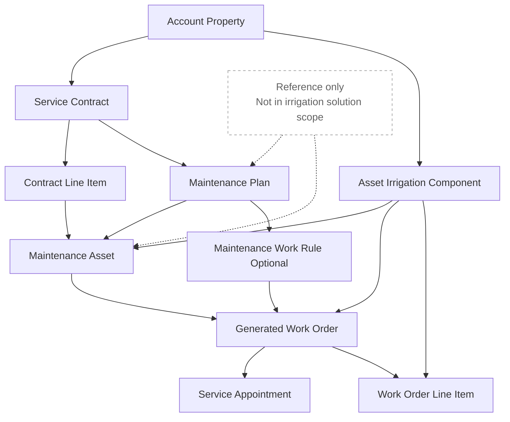

# Field Service Preventive Maintenance Data Model

Reference-only native FSM diagram. It explains the broader Salesforce maintenance object graph but is not part of the chosen irrigation implementation.

