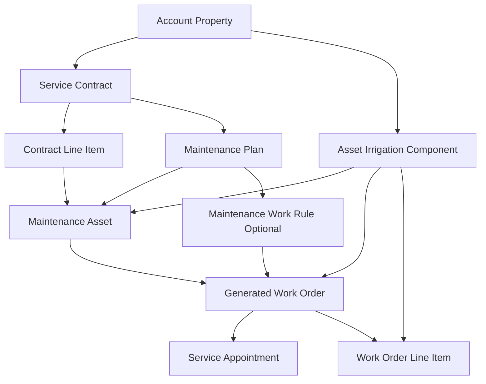

# FSM Service Plan Flow

```mermaid
flowchart TD
    A[Account Property] --> SC[Service Contract]
    A --> AS[Asset Irrigation Component]
    SC --> CLI[Contract Line Item]
    SC --> MP[Maintenance Plan]
    MP --> MA[Maintenance Asset]
    AS --> MA
    CLI --> MA
    MP --> MWR[Maintenance Work Rule Optional]
    MA --> WO[Generated Work Order]
    MWR --> WO
    WO --> SA[Service Appointment]
    WO --> WOLI[Work Order Line Item]
    AS --> WO
    AS --> WOLI
```
