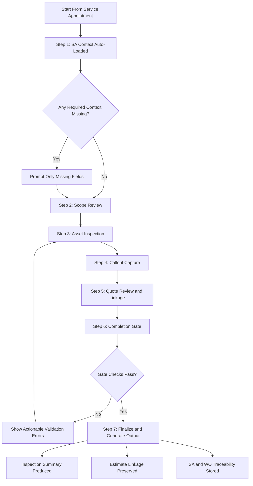

# IrrigationCheckups.com — Competitive Analysis and Requirements Assessment

Source: https://www.irrigationcheckups.com
Reviewed: May 5, 2026

## What It Is

IrrigationCheckups.com is a purpose-built SaaS inspection and reporting platform for irrigation professionals. Its core workflow is: perform a system checkup in the field using a mobile device → auto-generate a customized PDF report → create a repair quote → capture customer e-signature → share with client.

It is a standalone tool, not integrated into a CRM or FSM platform. It is not an invoicing or billing system.

Pricing: $79/mo PRO (unlimited checkups, up to 250 zones/controller, e-signature, price books, team users, company branding).

---

## Feature Inventory

### Client and Site Management
- Client accounts with contact information
- Multi-site support — one billing contact, multiple site locations
- Google Maps autocomplete for address entry
- Client site map showing all sites on a map

### System Inventory per Site
- Pumps
- Backflow devices (with geo-tag and photos)
- Controllers (model, zone count, accessories — master valve, sensors; geo-tag and photos)
- Sensors
- Zones (location description, landscaping type, head type, emitter type)
- Up to 5 photos per device

### Program Settings
- Days watering, start times, zone run times
- Conservation checkup shows estimated water savings with a new program

### Inspection / Checkup Workflow
- Customizable report templates (repair-focused or conservation-focused)
- Per-zone repair callouts with customizable issue types per template
- Voice-to-text notes on callouts
- Photo capture per zone/callout
- Fast quote building — callouts auto-populate quote line items during the checkup
- Parts list PDF generation for supply house ordering

### Geo-Tagging / Site Map
- GPS location capture for pumps, backflows, controllers, zone valves
- Property-specific site map showing all geo-tagged components
- Accuracy: consumer device GPS (5–20 ft range)

### Quoting
- Price books (multiple, assignable by client type or specific client)
- Quote items tied to specific repair callouts
- Quote auto-builds as callouts are recorded during the checkup
- Quote PDF generation
- Electronic signature capture — embedded in the final checkup report

### Reporting
- PDF report generation (customizable, company-branded)
- Repair-focused and conservation-focused report types
- Historical report storage (active subscription)
- Dashboard with weekly/monthly/annual trend reporting

### Team and Access
- Multi-user team accounts (PRO plan)
- Role-based access: Admin, Manager, Technician
- Multi-location hierarchy: Corporate → Division → Region → Branch
- Share in-process checkups between team users

---

## Requirements Derived for Our Salesforce FSM Build

### Already Captured in Our Design

| IrrigationCheckups Feature | Our Equivalent |
|---|---|
| Client account with multiple sites | Account (Property) with service location data |
| Backflow device record + photos | Asset (Record Type: Backflow) + Files |
| Controller record + zone count + photos | Asset (Record Type: Controller) + Files |
| Program settings (days, start time, run times) | `Irrigation_Program__c` child custom object |
| Zone descriptions (location, head type) | Asset (Record Type: Zone) with custom fields |
| Repair quote with price book | ExtraWork custom app (estimating) |
| Photo capture per component | Files on Asset |
| Historical inspection reports | Work Order / Service Appointment history per Asset |

---

### Gaps and New Requirements Identified

#### 1. Repair Callout Object
IrrigationCheckups has a structured "Repair Callout" concept — a discrete issue flagged at a specific zone or component during a checkup, with notes, photos, and an auto-linked quote item.

**Decision:** Repair Callouts are modeled as **Work Order Line Items with extended custom fields** — no separate custom object. Schema defined in [fsm_asset_architecture.md](fsm_asset_architecture.md):
- `Issue_Type__c` — Picklist (Broken Head / Valve Fault / Controller Issue / Leak / Low Pressure / Overwatering / Clog / Other)
- `Callout_Status__c` — Picklist (New / Quoted / Approved / Completed)
- `Callout_Notes__c` — Long Text Area
- `Callout_Photo__c` — Files attachment reference
- `ExtraWork_Estimate_Line_Ref__c` — Reference to linked ExtraWork estimate line

#### 2. Structured Inspection / Checkup Record
IrrigationCheckups treats each site visit as a discrete "Checkup" record — not just a work order. A checkup captures the full system state snapshot at a point in time (program settings, zone conditions, repair callouts).

Our current model uses Service Appointment + Work Order. Consider:
- Whether the SA/WO is sufficient as the checkup container, or
- Whether a dedicated `System_Checkup__c` object tied to the SA provides cleaner separation between scheduling and inspection data

#### 3. Conservation / Water Efficiency Audit Type
IrrigationCheckups distinguishes two inspection types: repair-focused and conservation-focused. The conservation type includes estimated water savings from program changes.

We have not modeled this. Requirements:
- Work Type differentiation: `Irrigation - Checkup (Repair Focus)` vs `Irrigation - Checkup (Conservation Focus)`
- On conservation checkup: capture current program run times and proposed run times
- Calculate and display estimated water savings (gallons/week, or % reduction)
- This could be formula fields on `Irrigation_Program__c` comparing current vs recommended run times

#### 4. Parts List Generation
IrrigationCheckups generates a parts list PDF for supply house ordering from a completed checkup.

We have not modeled a parts list workflow. Requirements:
- Work Order Line Items (parts) should be exportable as a parts list
- This could be a simple Report → PDF in Salesforce, or a custom action on the Work Order
- Coordinate with ExtraWork app — if estimate line items include parts, the parts list may come from ExtraWork output

#### 5. Geo-Tag During Field Audit (Mobile GPS Capture)
IrrigationCheckups captures GPS coordinates for backflows, controllers, and zone valves in the field at time of audit. This feeds the property site map.

Our design already has `Latitude`/`Longitude` on the Asset object. The missing piece is:
- A mobile-friendly flow or LWC in the FSM Mobile app that captures device GPS and writes it to the Asset record at audit time
- Without this, coordinates must be entered manually — high friction, likely skipped

This directly unblocks the Mapping options explored in `spatial_mapping_options.md`.

#### 6. Customer-Facing Report Delivery
IrrigationCheckups auto-generates a branded PDF report and delivers it to the customer, with e-signature capture embedded in the report.

Our ExtraWork app handles estimates and approvals. The gap is the **post-checkup inspection summary report** delivered to the customer showing:
- System inventory snapshot
- Issues found (repair callouts)
- Recommended program changes
- Quote summary (linked to ExtraWork estimate)

Requirements:
- Decide whether this report comes out of Salesforce (Visualforce/Report/Flow-generated PDF) or ExtraWork
- E-signature for quote approval is owned by ExtraWork — confirm whether inspection summary also needs signature or just delivery

---

## Summary Assessment

IrrigationCheckups.com is strong validation that the workflow we are building is the right one. Its feature set maps closely to our design. Key gaps it exposes:

1. **Repair Callout** as a structured in-field record during inspection — not currently modeled
2. **Checkup as a discrete record type** — may need cleaner separation from WO/SA
3. **Conservation audit work type** — water savings calculation not modeled
4. **Parts list generation** — not modeled, likely solved by WO Line Item report
5. **GPS capture at audit time** in FSM Mobile — unblocks Mapping
6. **Customer-facing inspection report** — needs a delivery mechanism and ownership decision (SF vs ExtraWork)

---

## Open Questions

- [x] Should Repair Callouts be a custom object or modeled as Work Order Line Items with an issue type/status? **→ Work Order Line Item with extra fields (Issue Type picklist, Status, Callout Notes, photo attachment).**
- [x] Is a discrete `System_Checkup__c` record needed, or is Service Appointment sufficient as the checkup container? **→ Service Appointment is sufficient. Attach checkup data directly to the SA.**
- [x] Who owns the post-checkup customer report delivery — Salesforce or ExtraWork? **→ Salesforce owns the report (Flow + PDF output or Visualforce).**
- [x] Should conservation audit / water savings estimation be in scope for this build? **→ Out of scope — future phase.**
- [x] Is GPS coordinate capture during field audit feasible in the FSM Mobile app at launch? **→ Yes — build GPS capture at launch. Custom LWC screen flow writes device GPS to Asset Latitude/Longitude fields.**

---

## Session Addendum — Learnings From Integrated Browser Review (May 27, 2026)

### Learning 1: SA-defined context removes redundant checkup setup
- Observation: IrrigationCheckups starts with explicit context selection (client/site/reason/report type).
- Interaction from discussion: We confirmed this is redundant for us because FSM Service Appointment already defines service type and assignment context.
- Decision impact: Start checkup directly from SA context and only prompt for missing values.

### Learning 2: Product value is execution guidance, not front-door data entry
- Observation: The flow value is in guided execution from inspection through output.
- Interaction from discussion: We aligned on prioritizing guided workflow and quality controls over additional setup fields.
- Decision impact: Invest in staged inspection UX tied to SA progression.

#### PRD Acceptance Criteria for Learning 2 (Execution Guidance)

##### A. Time-to-Complete Targets
- AC-2.1: Median time from opening an in-progress Service Appointment checkup flow to reaching "Ready to Finalize" is <= 15 minutes for a standard residential visit (1 controller, <= 12 zones).
- AC-2.2: P90 time from opening the checkup flow to "Ready to Finalize" is <= 25 minutes for the same scope.
- AC-2.3: Median time from first callout capture to linked estimate-line creation is <= 60 seconds.
- AC-2.4: Median time from "Finalize" to generated customer-facing summary artifact is <= 2 minutes.

##### B. Guided-Step Minimums
- AC-2.5: The experience must present at least 7 guided steps in sequence: SA Context, Scope Review, Asset Inspection, Callout Capture, Quote Review, Completion Gate, Finalize and Output.
- AC-2.6: Each step must display a single primary next action and step position (for example, "Step 3 of 7").
- AC-2.7: Users cannot skip directly to Finalize unless Completion Gate validations pass.
- AC-2.8: Users can navigate backward without losing entered data (autosave required at step transitions).

##### C. Service Appointment Context Rules
- AC-2.9: Client, site, service type, and assigned technician are auto-loaded from Service Appointment at flow start.
- AC-2.10: The flow must not prompt users to re-enter values already present on Service Appointment unless the value is missing or invalid.
- AC-2.11: Missing required SA context fields are surfaced as targeted prompts before inspection starts.

##### D. Completion Gate Checks (Required)
- AC-2.12: All assets in current appointment scope must be marked Checked, Deferred with reason, or Not Present with reason.
- AC-2.13: Every callout must include Issue Type and Asset/Zone association.
- AC-2.14: Any callout with severity Critical or Safety must include at least one photo.
- AC-2.15: Required system-level readings configured by Work Type (for example static pressure) must be completed before Finalize.
- AC-2.16: Null or empty display labels for scoped assets/zones are blocked at Finalize; user receives actionable validation messages.

##### E. Quote and Output Linkage
- AC-2.17: Every quotable callout can be converted to or linked with an estimate line without leaving the guided flow.
- AC-2.18: Final summary output includes inventory snapshot, callouts, and quote summary sections.
- AC-2.19: Output generation must preserve Service Appointment and Work Order references for traceability.

##### F. Quality and Reliability Metrics
- AC-2.20: >= 95% of completed checkups pass Completion Gate without reopening due to missing required fields.
- AC-2.21: <= 2% of completed checkups contain post-finalization data-quality defects related to null labels or missing required associations.
- AC-2.22: Flow autosave failure rate is < 1% of step transitions.

##### Intent Diagram (Mermaid)

### Learning 3: Structured callouts are the speed/consistency lever
- Observation: Repair entry is checklist-first with optional notes/photos.
- Interaction from discussion: We agreed structured issue capture should be primary, with free text as optional enrichment.
- Decision impact: Keep standardized issue taxonomy by asset/zone type.

#### PRD Acceptance Criteria for Learning 3 (Structured Callouts)

##### A. Coverage and Adoption Targets
- AC-3.1: >= 90% of callouts on completed checkups use a predefined issue type from the active taxonomy.
- AC-3.2: <= 10% of callouts use Other; Other requires a short explanation.

##### B. Required Structured Fields
- AC-3.3: Every callout must include Issue Type, related Asset or Zone, Severity, and Disposition before it can be saved as complete.
- AC-3.4: If Disposition is Deferred, Deferred Reason is required.
- AC-3.5: If Severity is Critical or Safety, at least one photo is required before Finalize.

##### C. Capture Speed and Usability
- AC-3.6: Median time to add a structured callout after selecting an asset or zone is <= 20 seconds.
- AC-3.7: P90 time to add a structured callout after selecting an asset or zone is <= 45 seconds.
- AC-3.8: Free-text notes are optional and cannot substitute for required structured fields.

##### D. Quote Linkage Expectations
- AC-3.9: Every quotable callout can be linked to or converted into an estimate line in <= 2 user actions after save.
- AC-3.10: Callout to estimate linkage preserves Issue Type and Asset or Zone association for traceability.

##### E. Taxonomy Governance and Analytics Integrity
- AC-3.11: Issue taxonomy is context-scoped by asset type and zone type (for example backflow, controller, zone).
- AC-3.12: Taxonomy updates are versioned and do not overwrite historical callout classifications.
- AC-3.13: Reporting can segment callouts by Issue Type, Severity, Disposition, and asset context across time.

##### F. Data Quality and Reliability Metrics
- AC-3.14: <= 2% of finalized checkups contain callouts missing required associations or structured fields.
- AC-3.15: <= 1% of callout save attempts fail due to platform or autosave error.
- AC-3.16: 100% of Critical or Safety callouts in finalized checkups meet photo requirement.

##### Implementation Notes
- Structured checklist-first capture is the default; free text is enrichment only.
- Avoid broad, unscoped picklists; present issue options filtered by context.
- Preserve an Other option with required explanation for edge cases.

### Learning 4: Quote linkage during inspection enables one-pass workflow
- Observation: Repair actions route directly to quote-related capture.
- Interaction from discussion: We aligned this prevents re-entry and supports technician throughput.
- Decision impact: Maintain direct linkage from callouts to estimate lines while in appointment.

#### PRD Acceptance Criteria for Learning 4 (In-Flow Quote Linkage)

##### A. Availability and Access
- AC-4.1: 100% of quotable callouts expose an Add to Estimate action within the same guided flow context.
- AC-4.2: Users can add one or more estimate lines from a single callout (for example labor + parts).

##### B. Speed and Throughput Targets
- AC-4.3: Median time from callout save to linked estimate-line creation is <= 60 seconds.
- AC-4.4: P90 time from callout save to linked estimate-line creation is <= 120 seconds.
- AC-4.5: Quote totals refresh immediately after line add, edit, or remove without full-page reload.

##### C. Link Integrity and Traceability
- AC-4.6: Each callout-to-estimate link stores callout ID, asset or zone ID, issue type, severity, creator, and timestamp.
- AC-4.7: Output artifacts preserve callout-to-quote mapping for audit and customer review.
- AC-4.8: Users can unlink and relink estimate lines; all link changes are audit logged.

##### D. Validation and Completion Expectations
- AC-4.9: Finalized checkups have <= 5% quotable callouts left unlinked to estimate lines, excluding Disposition values Monitor or Deferred.
- AC-4.10: If Disposition is Deferred, Deferred Reason is required and quote-link requirement is waived.
- AC-4.11: If a callout is deleted, the user must choose whether to delete linked estimate lines or preserve them with link removal.

##### E. Pricing and Suggestion Behavior
- AC-4.12: System provides default estimate suggestions by issue type and context (item, labor, quantity, price) when available.
- AC-4.13: Suggested values are editable based on role permissions.
- AC-4.14: If pricing catalog is unavailable, users can create provisional lines with pending price status.

##### F. Reporting and KPI Readiness
- AC-4.15: Reporting exposes quote linkage rate: linked quotable callouts divided by total quotable callouts.
- AC-4.16: Reporting exposes time-to-first-linked-estimate-line from first callout in the session.
- AC-4.17: Summary output includes callout quote disposition values: Quoted, Deferred, Monitor, or Not Quoted with reason.

##### Implementation Notes
- Prioritize capture-once behavior: callout details should pre-populate estimate-line context.
- Detect potential duplicate estimate suggestions and prompt Merge or Keep Both.
- Keep linkage interaction inside inspection flow to avoid cross-screen re-entry.

### Learning 5: Completion gates are essential but must be trustworthy
- Observation: Assets Checked provides a closeout control; some zone labels rendered as null in the checklist.
- Interaction from discussion: We agreed gates are useful only with strong validation and fallback display logic.
- Decision impact: Add required-field and label integrity checks before finalize.

#### PRD Acceptance Criteria for Learning 5 (Completion Gates)

##### A. Gate Coverage and Enforcement
- AC-5.1: 100% of finalized checkups must pass all hard-stop completion gate rules.
- AC-5.2: Finalize action is blocked when any hard-stop gate fails.
- AC-5.3: Save-in-progress remains available when Finalize is blocked.

##### B. Required Gate Checks
- AC-5.4: Every in-scope asset and zone is marked Checked, Deferred with reason, or Not Present with reason.
- AC-5.5: Every callout includes required structured fields: Issue Type, related Asset or Zone, Severity, and Disposition.
- AC-5.6: Critical or Safety callouts require at least one photo before Finalize.
- AC-5.7: Work Type-required system readings (for example static pressure) are completed before Finalize.
- AC-5.8: Null or empty asset or zone labels are blocked at Finalize with actionable error messages.
- AC-5.9: Quotable callouts are either linked to estimate lines or explicitly waived by disposition rule.

##### C. Error Handling and Usability
- AC-5.10: 100% of gate errors are field-specific and actionable (no generic validation-only messages).
- AC-5.11: Clicking a gate error deep-links user to the exact record or field requiring correction.
- AC-5.12: Median time to resolve gate errors and reach Ready to Finalize is <= 90 seconds.

##### D. Data Quality Outcomes
- AC-5.13: <= 3% of finalized checkups require reopening due to missing mandatory completion data.
- AC-5.14: <= 1% of finalized outputs contain null or empty display labels in customer-facing sections.
- AC-5.15: 100% of finalized Critical or Safety callouts satisfy required evidence rules.

##### E. Auditability and Policy Controls
- AC-5.16: Any waived gate condition is stored with waiver reason, user, timestamp, and policy reference.
- AC-5.17: Completion gate results are retained in audit history for each finalized checkup.

##### Implementation Notes
- Use hard-stop checks only for safety, compliance, and data integrity requirements.
- Keep informational and cosmetic checks as warnings, not blockers.
- Surface a single Ready to Finalize panel that summarizes pass and fail status.

### Learning 6: Mapping is high-value context but needs durable implementation choices
- Observation: In-checkup map supports field context; runtime warnings indicated maintainability concerns.
- Interaction from discussion: We aligned mapping should be treated as a core product surface, not an add-on.
- Decision impact: Use current map APIs and performance-safe loading patterns from launch.

#### PRD Acceptance Criteria for Learning 6 (Operational Mapping)

##### A. Core Availability and Rendering
- AC-6.1: 100% of in-scope assets with valid coordinates render on the map with correct type icon and label.
- AC-6.2: Map and asset list remain synchronized; selecting in one highlights and focuses the other.
- AC-6.3: Users can open mapped asset detail and start callout capture in <= 2 actions.

##### B. Geospatial Capture and Editing
- AC-6.4: Users can capture or update asset GPS coordinates in-flow during inspection.
- AC-6.5: Median time from initiating GPS capture to successful save is <= 30 seconds.
- AC-6.6: Where configured, zone geometry supports point, line, or polygon capture with geometry validation.
- AC-6.7: Coordinate state is visible to users (captured now, existing, or inferred).

##### C. Performance and Reliability
- AC-6.8: Median time to first interactive map state is <= 3 seconds on target mobile network profile.
- AC-6.9: Geodata save failure rate is <= 1% across map-edit operations.
- AC-6.10: Map availability issues do not block finalize unless Work Type enforces required geodata presence.

##### D. Offline and Sync Behavior
- AC-6.11: Map edits made offline or with intermittent connectivity are queued locally and synced without data loss.
- AC-6.12: Sync conflict events are surfaced with clear user resolution options and audit trail.

##### E. Data Quality and Governance
- AC-6.13: Geodata updates retain asset ID linkage and timestamped edit history.
- AC-6.14: Required geodata checks (when enabled by Work Type) are enforced at completion gate.
- AC-6.15: Final outputs can reference mapped asset locations where available without rendering null labels.

##### F. Platform and Maintainability Controls
- AC-6.16: Mapping implementation uses current supported API patterns (no deprecated marker approach in new builds).
- AC-6.17: API loading follows performance-safe patterns suitable for mobile execution.
- AC-6.18: Map failures produce actionable diagnostics distinct from validation errors.

##### Implementation Notes
- Treat map as an operational workflow surface, not a display-only visualization.
- Preserve list-first path for technicians who do not need map interaction for a given step.
- Keep map interactions in the inspection flow to minimize context switching.

### Learning 7: Report output is part of completion, not post-process
- Observation: Create PDF is a primary action in checkup detail.
- Interaction from discussion: We aligned customer-facing output should remain first-class in the flow.
- Decision impact: Keep Salesforce-owned inspection summary generation in the core closeout path.

#### PRD Acceptance Criteria for Learning 7 (Customer-Facing Output)

##### A. Generation and Availability
- AC-7.1: 100% of finalized checkups generate a customer-facing summary artifact without manual re-entry.
- AC-7.2: Median time from Finalize to report availability is <= 2 minutes.
- AC-7.3: P90 time from Finalize to report availability is <= 5 minutes.

##### B. Required Output Content
- AC-7.4: Report includes Service Appointment context, site summary, inspected assets and zones, and callout details.
- AC-7.5: Report includes quote summary and disposition when estimate lines exist.
- AC-7.6: Each callout shown in output preserves traceability fields: callout ID, asset or zone association, severity, and disposition.

##### C. Versioning and Auditability
- AC-7.7: Issued report versions are immutable; regeneration creates a new version with timestamp and actor.
- AC-7.8: Report lifecycle states are tracked: Generated, Sent, Viewed, Failed.
- AC-7.9: Delivery and generation events are stored with timestamp and source (user or system).

##### D. Reliability and Error Handling
- AC-7.10: Report generation failure rate is <= 1% across finalized checkups.
- AC-7.11: Failed generation attempts retry automatically and surface actionable diagnostics.
- AC-7.12: Report generation errors are distinct from completion-gate validation errors.

##### E. Data Quality Outcomes
- AC-7.13: <= 2% of issued reports require correction due to missing mandatory structured fields.
- AC-7.14: Output generation blocks null or empty labels for required customer-facing sections.

##### F. Ownership and Integration Boundaries
- AC-7.15: Salesforce remains the source of truth and system of record for inspection summary output.
- AC-7.16: External estimate workflows may link to the report but cannot overwrite issued inspection summary content.
- AC-7.17: Signature requirements are configurable by artifact type (inspection summary vs quote approval).

##### Implementation Notes
- Trigger report generation as a first-class completion step in finalize flow.
- Keep output schema aligned to structured callout and quote linkage models.
- Expose report version history and delivery status in appointment context.

### Learning 8: Reduce front-door prompts to improve field speed
- Observation: Asking for known context increases cognitive and time overhead.
- Interaction from discussion: You confirmed service type is already defined by SA, so setup should not repeat it.
- Decision impact: Prefill from SA and move users directly into inspection work.

#### PRD Acceptance Criteria for Learning 8 (Context Prefill and Prompt Minimization)

##### A. Context Hydration and Prefill
- AC-8.1: 100% of checkup starts auto-load client, site, service type, and assigned technician from Service Appointment when available.
- AC-8.2: Session start does not request re-entry of already-populated Service Appointment context fields.
- AC-8.3: Context hydration failure rate is <= 1% of session starts.

##### B. Prompt Rules and Exceptions
- AC-8.4: Users are prompted only for missing or invalid required context fields before inspection begins.
- AC-8.5: Non-critical optional context fields never block entry into inspection workflow.
- AC-8.6: Context overrides are role-based and require reason capture.

##### C. Start-Flow Speed Targets
- AC-8.7: Median time from opening checkup flow to first actionable inspection screen is <= 15 seconds.
- AC-8.8: P90 time from opening checkup flow to first actionable inspection screen is <= 30 seconds.
- AC-8.9: Users can continue immediately after completing missing required prompts without re-running setup steps.

##### D. Data Integrity and Auditability
- AC-8.10: 100% of context overrides are audit logged with prior value, new value, user, timestamp, and reason.
- AC-8.11: Duplicate context correction rate after checkup start is <= 5% of sessions.
- AC-8.12: Context summary is always visible at start for quick technician verification.

##### E. Reliability and Recovery
- AC-8.13: Context prefill failures surface actionable recovery guidance with fallback path in <= 1 user action.
- AC-8.14: Start-flow abandonment due to context issues is <= 2% of sessions.
- AC-8.15: Error messaging clearly distinguishes data-missing conditions from system-load failures.

##### Implementation Notes
- Treat Service Appointment as the authoritative source of start context.
- Minimize front-door prompts by enforcing prompt-only-for-exception behavior.
- Keep context visible but editable only by permitted roles.

